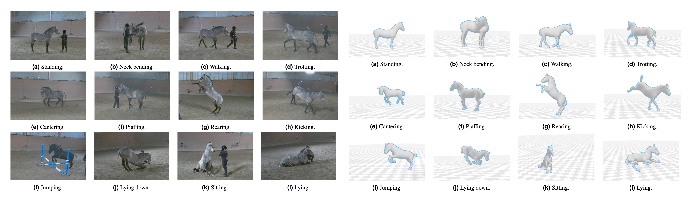

# DenseMocap Dataset



A dataset of horse motion capture in outdoor environments. The data can be accessed on [GoogleDrive](https://test.com). This repository provides example codes to visualize the data and evaluate the data.

## Installation

``` bash
git clone --recurse-submodules https://github.com/Celiali/test.git

# 1. Create a conda virtual environment.
conda create -n DenseMocap python=3.7
conda activate DenseMocap

pip install torch==1.8.2 torchvision==0.9.2 torchaudio==0.8.2 --extra-index-url https://download.pytorch.org/whl/lts/1.8/cu111
pip install opencv-python==4.7.0.72
pip install chumpy

# 2. For visualization 
pip install smplx[all]
pip install aitviewer==1.9.0

# 3. For loading c3d file
conda install -c conda-forge ezc3d=1.4.9

# 4. For evaluation
conda install -c conda-forge loguru
conda install -c anaconda scikit-learn=1.0.2
pip install git+https://github.com/nghorbani/human_body_prior.git@SOMA
pip install git+https://github.com/nghorbani/body_visualizer.git
```

The codes are tested in Python3.7, Pytorch 1.8.2, Aitviewer v1.9.0 for Ubuntu 18.0

Installation of `psbody.smpl` and `psbody.mesh`, please check [SOMA](https://github.com/nghorbani/soma).


## Fetch model
You need to download [the hSMAL model](https://sites.google.com/view/cv4horses/cv4horses) and place it under `./hSMALdata` folder.

## Fetch dataset 
You need to download [the DenseMocap dataset](https://sites.google.com/view/cv4horses/cv4horses) and follow directory structure of the data as below.
```
|--dataset
    |--[User ID]
        |-- C3D_DATA
            |--  [Trial Name].c3d
        |-- CAM_DATA
            |-- Camera_Miqus_Video_[Camera ID].npz
        |--FBX_DATA
            |-- [Trial Name].fbx
        |--KP2D_DATA
            |-- [Trial Name]
                |-- [Trial Name]_[Camera Code]_2Dkp.npz
        |--MODEL_DATA
            |-- [Trial Name]_hsmal.npz
            |-- [User ID]_stagei.npz
        |--SEGMENT_DATA
            |-- [Trial Name]_[Camera Code]_seg.mp4
        |--VIDEO_DATA
            |-- [Trial Name]
                |-- [Trial Name]_[Camera Code].avi
```

Data structure
```angular2html
Camera_Miqus_Video_[Camera ID].npz :
'R': rotation, 'T': translation, 'K': instrinsic parameters, 'D': Distortion parameters
```
```angular2html
[Trial Name]_[Camera Code]_2Dkp.npz :
'kp2d': 2D keypoints, 'mocap3d': 3D mocap, 'labels': names of the keypoints, 'videoFps': video framerate, 'videoFrameNum': video frame number
```

```angular2html
[Trial Name]_hsmal.npz :
'betas': beta parameters,  'poses': pose parameters, 'trans': translation parameters, 'missing_frame': frames where no model information 
```

```angular2html
[User ID]_stagei.npz :
'betas': beta parameters,  'marker_latent': the latent representation of the optimized marker positions, 'labels': names of the markers, 'flag': markers visible during Stage I optimization   
```

## Run demo code

- Loading c3d files and the hSMAL model with the captured parameters to visualize the mocap data and the fitted results.
  
```angular2html
python Load_Visualization.py --ID 1 --mocapname '20201128_ID_1_0004' --VISUAL_MOCAP
```

- Projecting the reconstructed model in image planes with provided camera information.
```angular2html
python Projection.py --ID 1 --mocapname '20201128_ID_1_0004' --cameraID '20715' --VISUAL --VISUAL_MOCAP
```  

- Quantitative evaluation using the mocap data and silhouette subsets.
```angular2html
python Eval_iou.py --ID 1 --mocapname '20201128_ID_1_0004' --VISUAL
python Eval_3Ddistance.py --ID 1 --mocapname '20201128_ID_1_0004' --VISUAL
```


## Acknowledgements
Thank Peter Kulits for providing interface for [Aitviewer](https://github.com/eth-ait/aitviewer). 
This work is based on [moshpp](https://github.com/nghorbani/moshpp).
Thanks for the authors for their efforts. 